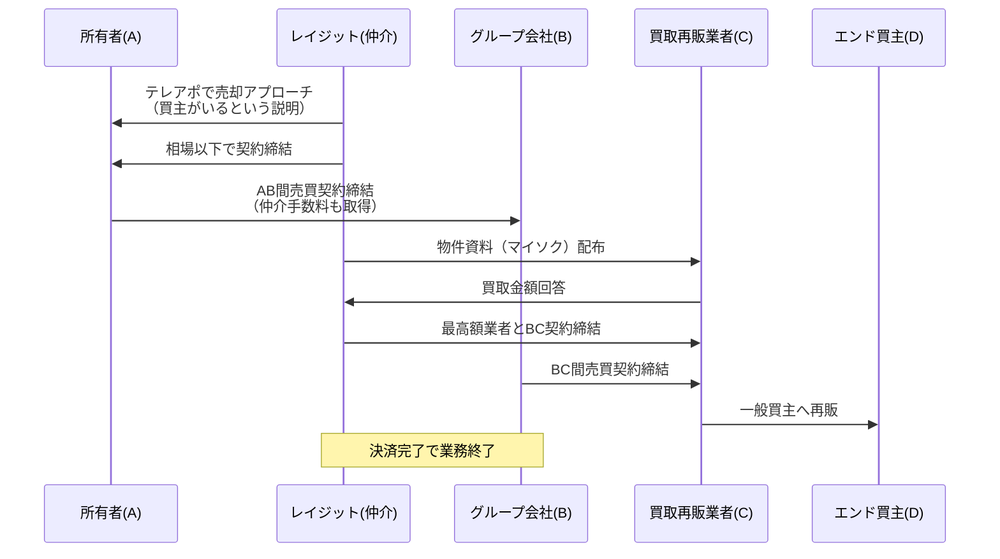
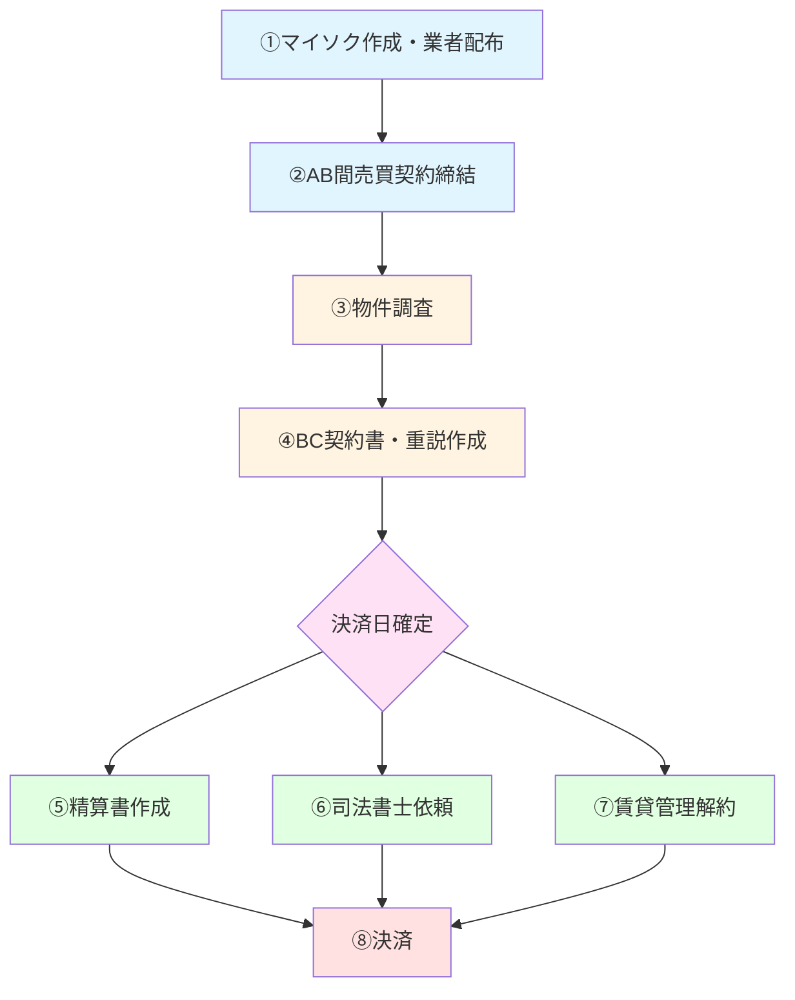

# クライアント情報 - レイジット

## 目次

1. [事業概要](#事業概要)
2. [業務フロー](#業務フロー)
3. [事務作業・管理業務](#事務作業管理業務)
4. [売上管理](#売上管理)
5. [用語集](#用語集)

---

## 事業概要

### 基本情報

- **事業内容**: 1R（ワンルーム）投資用マンション（賃貸マンション）の仲介業務
- **営業スタイル**: テレアポ
- **主要業務**: 既存オーナーへの売却促進営業（「物上げ」）
- **収益モデル**: 相場以下の金額での売却による利益獲得

### 物上げ業務の概要

#### 関係者定義

| 記号     | 定義               | 説明                           |
| -------- | ------------------ | ------------------------------ |
| **A**    | 所有者             | 1Rマンションを所有するオーナー |
| **B**    | 弊社のグループ会社 | 実際の買取を行うグループ会社   |
| **C**    | 買取再販業者       | 物件を買い取り、再販する業者   |
| **D**    | エンド（一般買主） | 最終的な購入者                 |
| **仲介** | 弊社（レイジット） | 仲介業務を行う会社             |

#### 物上げ業務フロー



#### 利益構造の例

| 取引           | 金額      | 備考                  |
| -------------- | --------- | --------------------- |
| AB間売買代金   | 1,000万円 | -                     |
| AB間仲介手数料 | 39.6万円  | Aから取得             |
| BC間売買代金   | 1,200万円 | 仲介手数料込み        |
| CD間売買代金   | 1,500万円 | Cの利益（管理対象外） |

**弊社（仲介＆B）の利益**: 1,200万円 - 1,000万円 + 39.6万円 = **239.6万円**

**買取業者（C）の利益**: 1,500万円 - 1,200万円 = **300万円**（※管理には関係なし）

---

## 業務フロー

### 全体フロー



**注意**: ①と②は前後する場合がある

---

## 事務作業・管理業務

### ① マイソク作成・業者配布

#### ①-現状

- **ツール**: Excel + PDF変換 + メール送付
- **管理**: スプレッドシート「【レイジット】出口管理表」
- **入力情報**: 物件名/号室/築年/賃料等 + 業者からの返答金額
- **進捗管理**: 同スプレッドシート内の「出口概要」タブ

#### ①-ステータス定義

| ステータス   | 表示 | 説明                                                                                                              |
| ------------ | ---- | ----------------------------------------------------------------------------------------------------------------- |
| **未仕入れ** | 水色 | AB間契約未締結。金額確認のため業者に配布中。金額が想定より高ければ仕入れに変更の可能性あり                        |
| **😭**       | 😭   | AB間契約締結済み。売主の必要経費借入待ちや賃契待ちのため、C業者確定不可。机上金額確認・想定利益把握のため業者配布 |
| **▲**        | ▲    | AB間契約締結済み。業者確定可能。業者最終稟議待ちまたは価格交渉中                                                  |
| **〇**       | 〇   | 業者確定済み                                                                                                      |

#### ①-ステータス遷移

```text
未仕入れ → 😭 → ▲ → 〇
```

**注意**: 未仕入れの状態がない案件もある（先にAB契約をしてからマイソクを配布するパターン）

#### ①-理想

- マイソク作成後、システム内で業者へ一括送付
- URL送付 + 金額回答フォーム
- 業者からの金額回答を自動反映
- 金額が高い順に並び替え
- 追いメール返信機能
- 過去データから業者別の平均金額・回答率を表示
- 進捗ステータスの分かりやすい設定

---

### ② AB間売買契約締結

**注意**: ①と②は前後する場合あり

---

### ③ 物件調査

#### ③-取得書類一覧

| 取得元       | 書類名         | 略称 |
| ------------ | -------------- | ---- |
| **建物管理** | 重要事項説明書 | 重調 |
|              | 管理規約       | -    |
|              | 長期修繕計画書 | 長計 |
| **賃貸管理** | 賃貸契約書     | 賃契 |
|              | 管理委託契約書 | -    |
| **役所**     | 公課証明       | -    |
|              | 建築概要       | -    |

#### ③-現状

- **ツール**: Evernote「調査関係」
- **入力情報**: 物件名/号室/仲介会社名/担当 + 必要書類
- **管理方法**:
  - 取得書類依頼前: 黄色に色変更
  - 取得依頼後: 色なし + 「待ち」記載
  - 取得完了: 文章削除
- **タイミング**: 営業から依頼を受けたタイミングから開始

**注意**: このタイミングでスプレッドシート「決済確定管理表」のBC未確定に情報を入力

#### ③-ステータス定義

| ステータス       | 表示              | 説明                                                                                                                         |
| ---------------- | ----------------- | ---------------------------------------------------------------------------------------------------------------------------- |
| **依頼前**       | 黄色              | 取得書類の依頼ができていない状態。営業からの依頼待ち、または管理会社が定休日等で依頼不可。ほとんどの場合は営業からの依頼待ち |
| **依頼済み**     | 色なし + 「待ち」 | 依頼完了後                                                                                                                   |
| **取得完了**     | 文章削除          | 書類取得完了                                                                                                                 |
| **営業依頼待ち** | ピンク + ※        | 営業依頼待ちの物件を分かりやすくするため。営業からチャットワークで依頼があればピンクの文章を削除                             |

#### ③-理想

- 誤削除防止機能（簡単に消せないようにする）
- 入力日・依頼日・取得日の記録
- チェックボックスによるワンクリック進捗管理

---

### ④ BC契約書・重説作成

#### ④-現状

- **タイミング**: AB契約完了後、物件調査完了後、買取業者に問題なく売却可能になった時点
- **業者選定**: ①で配布した業者で最高額の業者に諸条件確認後、問題なければBC契約を進める旨を連絡

**注意**: このタイミングでスプレッドシート「決済確定管理表」のBC未確定部分から情報を移動

- **ツール**: Evernote「BC関係」
- **入力情報**: 物件名/号室/買取業者/仲介会社/担当/B会社名/手付金/進捗

#### ④-進捗フロー

```text
新規作成
  ↓
送付CB（チェックバック）待ち（BC売契・重説ドラフト送付時）
  ↓
業者CB済（CB完了時、BC契約日を業者と相談して確定）
  ↓
業者契約待ち（契約日に契約締結）
  ↓
BC契約締結済み（エバーノート内「BC契約締結済み R7年」に移動）
```

#### ④-理想

- 誤削除防止機能
- BC売契作成日・送付日・CB日の記録
- チェックボックスによるワンクリック進捗管理

---

### ⑤ 精算書作成

#### ⑤-現状

- **タイミング**: 決済日確定後
- **ツール**: Evernote「精算書」
- **入力情報**: 物件名/号室/買取業者/仲介会社/担当/B会社名/手付金/決済日/進捗

#### ⑤-進捗フロー

```text
新規作成
  ↓
送付CB（チェックバック）待ち（精算書ドラフト送付時）
  ↓
CB済 売主（A）用作成（CB完了時）
  ↓
作成済CR（チェックリスト）（売主用精算書作成済み）
  ↓
CR済（上席のチェックバック完了）
  ↓
決済済み（エバーノート内「決済済み R7年」に移動）
```

#### ⑤-マーク定義

| マーク | 意味             | 説明                                                                                                                                                                                 |
| ------ | ---------------- | ------------------------------------------------------------------------------------------------------------------------------------------------------------------------------------ |
| **■**  | ローン計算書あり | 物件名の先頭に付与。ローン計算書は売主が借入先の銀行から取得する書類で、ローン一括返済額や返済当日の送金先口座等が記載されている。ローン計算書がないと決済及び精算書の作成ができない |
| **〇** | 当月決済         | 物件名の先頭に付与。精算書の作成は決済の1カ月以上前から進めることがほとんどであるため、当月決済案件を優先的に作成するために付与                                                      |
| **△**  | 翌月決済         | 物件名の先頭に付与                                                                                                                                                                   |

**注意**: ローン計算書が取得できていない場合は、売主の一括返済額が不明のため、売主（A）の精算書を作成できない

#### ⑤-理想

- 誤削除防止機能
- BC精算書作成日・送付日・CB日・売主用精算書作成完了日の記録
- チェックボックスによるワンクリック進捗管理

---

### ⑥ 司法書士依頼

#### ⑥-現状

- **タイミング**: 決済日確定後
- **ツール**: スプレッドシート（共有）
  - 林先生×レイジット 共有シート
  - 谷口先生×レイジット 共有シート
  - 石橋先生×レイジット 共有シート
  - 買書士 一本化
- **共有方法**: ドライブの共有フォルダにて売契等の資料を司法書士に共有
- **進捗管理**: スプレッドシート内で司法書士が入力（スプレッドシートは司法書士も閲覧可能）

#### ⑥-理想

- システム内での情報入力
- 司法書士依頼が遅れている場合のアラート機能
- システム内で司法書士にも情報共有

---

### ⑦ 賃貸管理解約

#### ⑦-現状

- **タイミング**: 決済日確定後
- **目的**: 売主が他社と締結している管理契約を解約（家賃送金の切り替え）
- **注意点**: 管理解約ができていなければ、決済後に再度家賃の精算が必要
- **申し込み時期**: 管理解約日の2～3ヶ月前（管理会社による）
- **課題**: 管理解約の申し込みを営業が行っているため、会社側では営業にヒアリングする以外に管理解約状況を確認する方法がない

#### ⑦-理想

- 案件ごとの管理解約月入力機能
- 管理解約手続き完了をワンクリックで入力
- アラート機能による抜け漏れ防止
- 管理解約日・管理解約依頼日の記録

---

### ⑧ 決済

決済完了で業務終了

---

### 営業連携

**現状**: 営業から書類作成の依頼をチャットワークで事務員に依頼

**理想**: システム内で営業と事務員が連携できる機能

---

## 売上管理

### 売上計上の定義

**基本ルール**: AB間の契約締結からC業者の確定までに時間がかかるため、以下のルールで売上計上を行う。

- **当月契約 + 翌月末日までにC業者確定**: 当月の売上として計上
- **翌月末日までにC業者確定できなかった場合**: 確定した月の前月の数字に計上

#### 売上計上の例

| AB契約日 | C業者確定日 | 売上計上月 | 理由                         |
| -------- | ----------- | ---------- | ---------------------------- |
| 8月15日  | 8月30日     | **8月**    | 当月契約・当月確定           |
| 8月15日  | 9月27日     | **8月**    | 当月契約・翌月末日までに確定 |
| 8月15日  | 10月3日     | **9月**    | 確定した月の前月             |
| 8月15日  | 11月30日    | **10月**   | 確定した月の前月             |

---

### スプレッドシート「ホワイトボード PC版」の定義

#### 通常パターン: 当月契約・翌月末日までに確定

1. **AB間契約締結時**: 当月の「今月仕入物件一覧」に以下を入力
   - 担当/物件名/仕入れ金額等
   - プルダウン選択で「未確定」を選択

2. **業者確定時**: プルダウンを「確定」に変更

3. **売上反映**: 左側の各営業の数字に売上数字を反映

**ステータス対応**:

- 未確定 → 出口管理表の「▲」または「😭」状態
- 確定 → 出口管理表の「〇」状態

---

#### イレギュラーパターン: 当月契約・翌月末日までに確定しなかった

**例**: 6月15日に契約、7月末日までに業者が確定できていない

1. **ステータス変更**: 「未確定」→「次月」に変更
2. **移動**: 7月のページの「未確定案件一覧」に案件をコピペして移動
3. **確定時**: 8月中に業者が確定した場合、前月（7月）の数字になるため、7月の「未確定物件一覧」から「今月仕入物件一覧」に移動
4. **配置**: 当月仕入れ物件と区別するため、「今月仕入物件一覧」の下から順番に移動

---

#### 特殊ステータス

| ステータス     | 説明                                                               | 売上計上                                                                                                     |
| -------------- | ------------------------------------------------------------------ | ------------------------------------------------------------------------------------------------------------ |
| **違約入金済** | 売主から違約金が入金された場合                                     | 着金が取れた月に売上計上。当月に違約金が入金された場合は当月の売上計上                                       |
| **違約予定**   | 違約となることが固まっているが、違約金の入金が確認できていない状態 | 未確定のステータスと類似。違約金の入金待ち。当月に違約金の入金が確認できない場合は翌月の未確定物件一覧に移動 |
| **弁護士**     | 売主から内容証明が届いたり、こちらから起訴を起こしている状態       | こちらの都合で業者確定等ができないため、当月に方向性が固まらなければ翌月以降は未確定物件一覧に移動           |

---

## 用語集

| 用語             | 説明                                                                                         |
| ---------------- | -------------------------------------------------------------------------------------------- |
| **物上げ**       | 既に1Rを所有しているオーナーに対してアプローチを行い、売却を促す営業                         |
| **マイソク**     | 物件資料                                                                                     |
| **重調**         | 重要事項説明書                                                                               |
| **長計**         | 長期修繕計画書                                                                               |
| **賃契**         | 賃貸契約書                                                                                   |
| **重説**         | 重要事項説明書                                                                               |
| **CB**           | チェックバック                                                                               |
| **CR**           | チェックリスト                                                                               |
| **スプシ**       | スプレッドシート                                                                             |
| **ローン計算書** | 売主が借入先の銀行から取得する書類。ローン一括返済額や返済当日の送金先口座等が記載されている |

---

## システム要件のまとめ

### 共通要件

- 誤削除防止機能
- 日付記録機能（入力日・依頼日・取得日・送付日・CB日等）
- チェックボックスによるワンクリック進捗管理
- 営業と事務員の連携機能

### 各機能の要件

1. **マイソク配布**: URL送付、金額回答フォーム、自動反映、並び替え、業者分析
2. **物件調査**: 書類取得状況の可視化、進捗管理
3. **BC契約**: 契約書作成から締結までの進捗管理
4. **精算書**: 精算書作成から決済までの進捗管理、ローン計算書管理
5. **司法書士依頼**: アラート機能、情報共有
6. **賃貸管理解約**: 解約月管理、アラート機能
7. **売上管理**: 売上計上ルールに基づく自動計算
