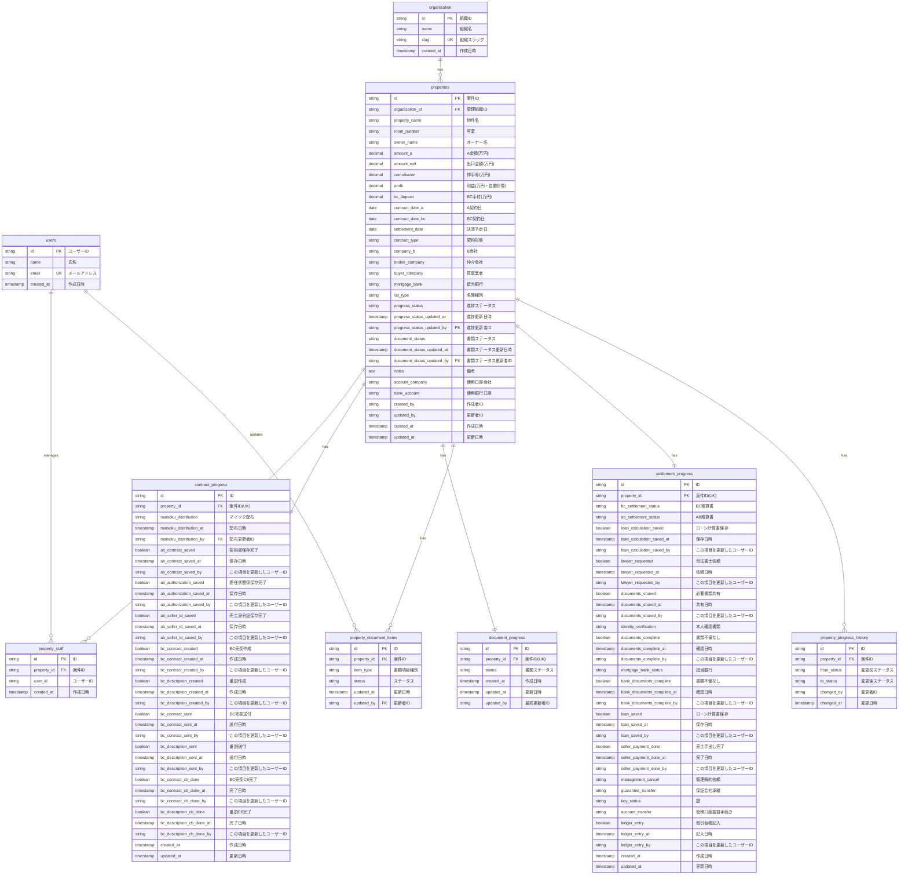

# 案件管理システム ER図

## バージョン情報

- **作成日**: 2025-10-25
- **更新日**: 2025-12-12
- **バージョン**: 1.1
- **対象フェーズ**: MVP（最小限の機能を実装した初期バージョン）

---

## ER図

---

## 書類項目種別 (item_type) の値

### 銀行関係

| 値               | 表示名       |
| ---------------- | ------------ |
| loan_calculation | ローン計算書 |

### 賃貸管理関係

| 値                  | 表示名       |
| ------------------- | ------------ |
| rental_contract     | 賃貸借契約書 |
| management_contract | 管理委託契約書 |
| move_in_application | 入居申込書   |

### 建物管理関係

| 値                        | 表示名           |
| ------------------------- | ---------------- |
| important_matters_report  | 重要事項調査報告書 |
| management_rules          | 管理規約         |
| long_term_repair_plan     | 長期修繕計画書   |
| general_meeting_minutes   | 総会議事録       |
| pamphlet                  | パンフレット     |
| bank_transfer_form        | 口座振替用紙     |
| owner_change_notification | 所有者変更届     |

### 役所関係

| 値                     | 表示名           |
| ---------------------- | ---------------- |
| tax_certificate        | 公課証明         |
| building_plan_overview | 建築計画概要書   |
| ledger_certificate     | 台帳記載事項証明書 |
| zoning_district        | 用途地域         |
| road_ledger            | 道路台帳         |

---

## 書類項目ステータス (status) の値

| 値            | 表示名 |
| ------------- | ------ |
| not_requested | 未依頼 |
| requesting    | 依頼中 |
| acquired      | 取得済 |
| not_required  | 不要   |

---

## 参照ドキュメント

- [テーブル定義詳細](./er-diagram.md)
- [Better Auth スキーマ](../../../../packages/drizzle/schemas/auth.ts)

---

最終更新: 2025-12-12
