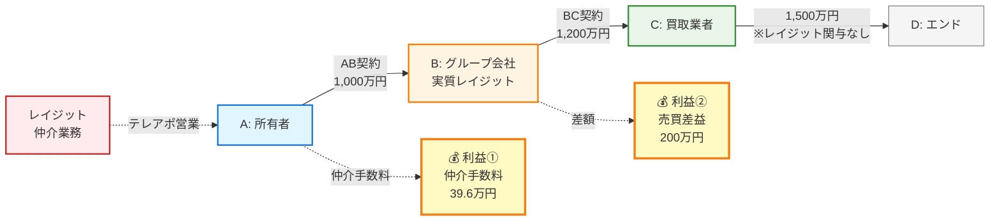
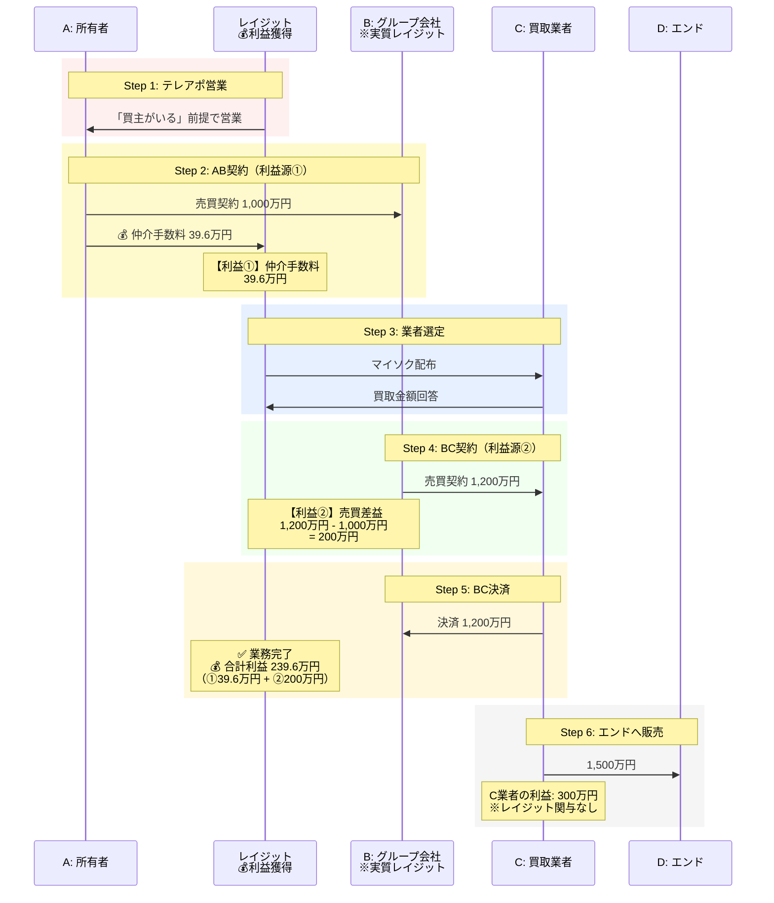

# 案件管理システム MVP要件定義書（顧客向け）

## バージョン情報

- **作成日**: 2025-10-14
- **バージョン**: 1.0
- **対象フェーズ**: MVP（最小限の機能を実装した初期バージョン）

---

## 1. システム概要

### 1.1 目的

1R投資用マンションの物上げ業務における案件管理を効率化し、現在スプレッドシートやEvernoteで管理している情報を一元管理できるシステムを構築します。

### 1.2 現在の課題

- スプレッドシートで管理しているため、誤って情報を削除してしまうリスクがある
- 案件の進捗状況が分かりにくい
- 複数の場所に情報が分散している（スプレッドシート、Evernote等）
- 手入力が多く、入力ミスが発生しやすい
- 担当者間での情報共有が難しい

### 1.3 システム導入による効果

- 案件情報の一元管理
- 進捗状況の可視化
- 誤削除の防止
- 入力作業の効率化
- 担当者間での情報共有の円滑化
- データの正確性向上

### 1.4 MVP（初期バージョン）で実現すること

MVPでは、以下の2つの主要機能を実装します：

1. **ログイン・組織管理機能**
   - 会社別の組織管理（レイジット・エスク・TOUSEI）
   - 会社内のチーム管理（営業チーム・事務チーム）
   - システムオーナー（経営者）による全社データアクセス
   - チームごとに権限を設定（オーナー・管理者・メンバー）
   - Active Organization方式による組織切り替え
   - 安全なログイン機能

2. **案件管理機能**
   - 案件の登録・編集・削除（管理組織の指定）
   - 進捗状況の管理（業者ステータス・書類ステータス）
   - 案件一覧の表示（BC確定前／月次、管理組織列を含む）
   - 案件詳細の表示（管理組織を含む）
   - 組織とチームによる編集権限制御（全チームで全項目編集可能）

3. **口座管理機能**
   - 口座（銀行）ごとの決済金額上限管理

### 1.5 MVP以降に実装検討予定

以下の機能は、初期バージョン（MVP）では実装せず、運用状況を見ながらMVP以降での実装を検討します：

- 仲介会社ごとの件数集計表示
- 案件一覧の並び替え機能の拡張
- 仲介会社別の案件グルーピング表示
- プルダウン項目ごとの色分け表示
- マイソク作成・業者への一括配布機能
- 営業から事務員への依頼機能
- 書類のアップロード・保存機能
- アラート・リマインダー機能（期限が近づいたら通知する機能）
- レポート・分析機能
- 外部システムとの連携

---

## 2. ビジネスの理解

### 2.1 御社の事業概要

- **主要業務**: 1R投資用マンションの物上げ（既存オーナーへの売却営業）
- **営業手法**: テレアポ
- **収益構造**: 相場以下での仕入れと適正価格での転売による差益

### 2.2 取引の流れ

#### 2.2.1 関係者の定義

- **A**: 所有者（売主）
- **B**: グループ会社（買取会社）
- **C**: 買取再販業者
- **D**: エンド（一般買主）
- **仲介**: レイジット（御社）

#### 2.2.2 取引の全体像と金額の流れ



**レイジットの利益構造**:

| 利益源       | 取引   | 金額          | 備考                                        |
| ------------ | ------ | ------------- | ------------------------------------------- |
| 💰 **利益①** | AB契約 | **39.6万円**  | Aから受け取る仲介手数料                     |
| 💰 **利益②** | BC契約 | **200万円**   | Bはグループ会社なので差額がレイジットの利益 |
| 🎯 **合計**  | -      | **239.6万円** | レイジットの利益（BC決済完了で業務終了）    |

**その他**:

- **C業者の利益**: 300万円（1,500万円 - 1,200万円）※レイジットの管理外

**ポイント**:

- レイジットは「買主がいる」という形でAにアプローチ
- Bはグループ会社だがAには説明せず、仲介手数料を取得
- AB間の価格差（200万円）+ 仲介手数料（39.6万円）= レイジットの利益（239.6万円）
- BC決済完了で**レイジットの業務は終了**（CD取引は関与しない）

#### 2.2.3 取引の流れ（時系列）



**レイジットの利益構造**:

| 利益源          | 取引   | 金額          | 説明                            |
| --------------- | ------ | ------------- | ------------------------------- |
| **①仲介手数料** | AB契約 | 39.6万円      | Aから受け取る仲介手数料         |
| **②売買差益**   | BC契約 | 200万円       | BC間の価格差（B＝グループ会社） |
| **合計利益**    | -      | **239.6万円** | ①+②の合計                       |

**各ステップの詳細**:

| ステップ          | 内容                          | レイジットの利益              |
| ----------------- | ----------------------------- | ----------------------------- |
| 1. 営業アプローチ | テレアポでAに売却を提案       | -                             |
| 2. AB契約締結     | A→Bへ1,000万円で売却          | 💰 39.6万円（仲介手数料）     |
| 3. 買取業者選定   | マイソクを配布し、C業者を選定 | -                             |
| 4. BC契約締結     | B→Cへ1,200万円で転売          | 💰 200万円（売買差益）        |
| 5. BC決済完了     | 決済完了                      | **業務終了（合計239.6万円）** |
| 6. エンドへの販売 | C→Dへ1,500万円で販売          | 関与なし                      |

#### ポイント

- Bは実質的にグループ会社だが、Aには「買主がいる」という形で仲介
- AB間の価格差とAからの仲介手数料が御社の利益
- BC決済完了で御社の業務は終了

### 2.3 利益の計算

#### 利益の計算式

```text
利益 = 出口金額 - A金額 + 仲手等
```

#### 具体例

- AB間: 売買代金 1,000万円 + 仲介手数料 39.6万円
- BC間: 売買代金 1,200万円（仲介手数料込み）
- 御社の利益: 239.6万円（差益200万円 + 仲介手数料39.6万円）

### 2.4 売上計上のルール

**基本ルール**:
当月に契約をした物件を翌月末日までにC業者（買取業者）を確定できれば、当月の売上として計上します。

**具体例**:

- 8月15日契約 → 9月27日にC確定 → 売上計上月: 8月
- 8月15日契約 → 10月3日にC確定 → 売上計上月: 9月

---

## 3. ログイン・組織管理機能

### 3.1 機能の目的

- 社員ごとに権限を設定し、適切な操作のみを許可する
- 会社組織ごとにデータを分離し、アクセス権限を制御する
- チーム（営業・事務）ごとにメンバーをグルーピングする
- システムオーナー（経営者）は全社のデータにアクセス可能
- Active Organization方式で組織を瞬時に切り替え可能
- 安全にログインできるようにする

### 3.2 組織の管理

#### 3.2.1 組織とは

組織は、会社単位で管理されます。各会社が独立した組織として扱われ、その中でチーム（営業・事務）が編成されます。

**標準的な組織構成**:

- **レイジット**: レイジット社の案件を管理
- **エスク**: エスク社の案件を管理
- **TOUSEI**: TOUSEI社の案件を管理

各組織（会社）の中に、以下のチームが存在します：

- **営業チーム**: 営業担当者が所属
- **事務チーム**: 事務担当者が所属

#### 3.2.2 組織とチームの関係

```
レイジット（組織）
  ├─ 営業チーム
  │   ├─ Aさん（owner）
  │   ├─ Bさん（admin）
  │   └─ Cさん（member）
  └─ 事務チーム
      ├─ Dさん（admin）
      └─ Eさん（member）

エスク（組織）
  ├─ 営業チーム
  └─ 事務チーム

TOUSEI（組織）
  ├─ 営業チーム
  └─ 事務チーム
```

#### 3.2.3 組織とチームの特徴

- 各ユーザーは複数の組織に所属できます（稀なケース）
  - 例: 複数の会社を兼務する社員
- 各ユーザーは同じ組織内の複数のチームに所属できます（稀なケース）
  - 例: 営業と事務を兼務する社員
- 基本的には、1つの組織（会社）の1つのチームに所属
- システムオーナー（owner）は全組織のデータにアクセス可能

#### 3.2.4 組織の情報

- 組織名（レイジット / エスク / TOUSEI）
- 作成日
- 所属チーム（営業チーム / 事務チーム）

#### 3.2.5 組織の追加

新しい会社組織の追加は、システムオーナー（owner）が実施します。
年間1社程度の追加が見込まれます。

**組織追加時の処理**:

1. 新しい組織を作成
2. 既存のownerロールを持つユーザー全員を新組織にも追加
3. 必要に応じてチーム（営業チーム・事務チーム）を作成

#### 3.2.6 Active Organization（現在の作業組織）

Active Organizationは、現在作業中の組織を表します。ヘッダーのドロップダウンで瞬時に切り替えることができます。

**システムオーナー（owner）の場合**:

- Active Organizationを「全社」に設定すると、全組織のデータを表示
- Active Organizationを特定の組織に設定すると、その組織のデータのみ表示

**一般ユーザー（admin/member）の場合**:

- 複数組織に所属している場合、Active Organizationを切り替えてデータを表示
- 単一組織のみの場合、その組織のデータのみ表示

#### 3.2.7 将来的な拡張予定

顧客のニーズに応じて、チームをさらに細分化できる機能を検討中です。例えば：

- 営業チーム → 一般営業、管理職営業
- 事務チーム → 一般事務、管理職事務

各細分化されたチームごとに、閲覧範囲と編集可能範囲を個別に設定できるようにする予定です。MVPでは、まず営業・事務の2チームで運用を開始します。

### 3.3 ユーザー（社員）の管理

#### 3.3.1 ユーザーとは

- 社員一人ひとりがユーザーとして登録されます
- 各ユーザーは自分のメールアドレスとパスワードでログインします
- 各ユーザーは複数の組織に所属できます

#### 3.3.2 ユーザーの情報

- 氏名
- メールアドレス
- パスワード
- プロフィール画像（オプション）
- 所属組織（会社）（複数可、通常は1つ）
- 所属チーム（営業/事務）（複数可、通常は1つ）
- 組織内での権限（owner/admin/member）

#### 3.3.3 ログイン方法

- メールアドレスとパスワードでログイン
- パスワードを忘れた場合は、メールでリセットリンクを受け取れます
- ログイン後、Active Organizationが自動設定されます
  - システムオーナー（owner）: Active Organization = null（全社）
  - 一般ユーザー（admin/member）: Active Organization = 最初の所属組織

### 3.4 権限（ロール）の管理

#### 3.4.1 権限の種類

システム内での権限は、組織レベルで管理されます：

| 権限   | 呼び方           | 役割                                                             |
| ------ | ---------------- | ---------------------------------------------------------------- |
| owner  | システムオーナー | 組織の作成者。全社のデータにアクセス可能。組織の追加・削除が可能 |
| admin  | 管理者           | チームの管理者。チームメンバーの招待や削除ができる               |
| member | メンバー         | チームの一般メンバー                                             |

**補足**:

- `owner`ロールは経営者を表します
- 組織を作成したユーザーが自動的に`owner`になります
- 新しい組織が追加されると、既存の`owner`全員が新組織にも追加されます
- チームは純粋にメンバーをグルーピングするためのものです

#### 3.4.2 システムオーナー（経営者）

**対象**: 経営者（複数名）

**組織内での権限**: owner

**できること**:

- 全組織（レイジット・エスク・TOUSEI）の全案件の閲覧・編集・削除
- 新しい組織（会社）の追加
- 組織の削除
- 全組織へのメンバー招待
- 売上・利益の集計データの閲覧（全社横断）
- レポート機能の利用（将来実装）

**画面アクセス**:

- ✅ 全社のBC確定前案件一覧（管理組織列が表示される）
- ✅ 全社の月次案件一覧（管理組織列が表示される）
- ✅ 全社の案件詳細
- ✅ 全案件の編集（全項目編集可能）
- ✅ 組織管理画面
- ✅ 売上レポート（将来実装、全社横断）

**Active Organizationの使い方**:

- 「全社」を選択: 全組織のデータを表示
- 特定の組織を選択: その組織のデータのみ表示

**データアクセス範囲**:

- Active Organization = null（全社）: 全組織の全案件
- Active Organization = 特定の組織: その組織の案件のみ

#### 3.4.3 営業チーム

**対象**: 営業担当者

**組織内での権限**: admin（チーム管理者）またはmember（チームメンバー）

**できること**:

- 自社（Active Organizationで選択中の組織）の全案件の閲覧
- 案件の作成（自社の案件として登録）
- 案件の編集（全項目）
  - 基本情報（物件名、オーナー名、金額等）
  - 契約進捗
  - 書類進捗
  - 決済進捗
- 自分が作成した案件の削除
- チームへのメンバー招待（adminの場合）
- 自分の担当案件の管理
- 自社の売上・利益の集計データの閲覧

**画面アクセス**:

- ✅ 自社のBC確定前案件一覧（管理組織列が表示される）
- ✅ 自社の月次案件一覧（管理組織列が表示される）
- ✅ 自社の案件詳細
- ✅ 自社の案件編集（全項目編集可能）

**Active Organizationの使い方**:

- 単一組織のみの場合: 自動的にその組織が選択される
- 複数組織の場合: ドロップダウンで組織を切り替え

**データアクセス範囲**:

- Active Organizationで選択中の組織の案件のみ

#### 3.4.4 事務チーム

**対象**: 事務担当者

**組織内での権限**: admin（チーム管理者）またはmember（チームメンバー）

**できること**:

- 自社（Active Organizationで選択中の組織）の全案件の閲覧
- 案件の作成（自社の案件として登録）
- 案件の編集（全項目編集可能）
  - ✅ 基本情報の編集
  - ✅ 金額情報の編集
  - ✅ 契約形態・B会社・仲介会社の編集
  - ✅ 契約進捗の更新
  - ✅ 書類進捗の更新
  - ✅ 決済進捗の更新
  - ✅ 備考の編集
- チームへのメンバー招待（adminの場合）

**注意**: 事務員が案件情報の入力を主に担当するため、MVPでは全項目の編集を可能とします。

**画面アクセス**:

- ✅ 自社のBC確定前案件一覧（管理組織列が表示される）
- ✅ 自社の月次案件一覧（管理組織列が表示される）
- ✅ 自社の案件詳細
- ✅ 自社の案件編集（全項目編集可能）

**Active Organizationの使い方**:

- 単一組織のみの場合: 自動的にその組織が選択される
- 複数組織の場合: ドロップダウンで組織を切り替え

**データアクセス範囲**:

- Active Organizationで選択中の組織の案件のみ

#### 3.4.5 編集制限の詳細（事務チーム）

**MVPでの対応**: 事務員が案件情報の入力を主に担当する実態に合わせ、MVPでは事務チームも全項目の編集を可能とします。将来的に、チームをさらに細分化（一般事務・管理職等）した際に、編集権限の詳細な制御を実装する予定です。

##### タブ1: 基本情報

- ✅ 全ての項目（編集可能）

##### タブ2: 契約進捗

- ✅ 全ての項目（編集可能）

##### タブ3: 書類進捗

- ✅ 全ての項目（編集可能）

##### タブ4: 決済進捗

- ✅ 全ての項目（編集可能）

### 3.5 メンバーの招待機能

#### 3.5.1 招待の流れ

1. 組織の**管理者（admin）**が、新しいメンバーのメールアドレスと権限を指定して招待を送信
2. 招待メールが送信される
3. 招待された人が招待リンクをクリック
4. 既にアカウントがある場合: ログイン後、組織に参加
5. アカウントがない場合: アカウント作成後、組織に参加

#### 3.5.2 招待の有効期限

招待リンクは7日間有効です。期限を過ぎた場合は、再度招待を送信する必要があります。

#### 3.5.3 権限別の招待可能範囲

| ユーザー種別              | 招待できる範囲                       |
| ------------------------- | ------------------------------------ |
| システムオーナー（owner） | 全組織の全チームにメンバーを招待可能 |
| チーム管理者（admin）     | 自チームにメンバーを招待可能         |
| チームメンバー（member）  | 招待不可                             |

### 3.6 Active Organization（現在の作業組織）

#### 3.6.1 Active Organizationとは

Active Organizationは、現在作業中の組織を表します。ヘッダーのドロップダウンで瞬時に切り替えることができます。

#### 3.6.2 組織の切り替え方法

**ヘッダーに組織切り替えドロップダウンを配置**:

- システムオーナー（owner）: 「全社」+ 全組織から選択
- 一般ユーザー（admin/member）: 所属組織から選択

**画面遷移なしで瞬時に切り替え**:

- ドロップダウンで組織を選択するだけ
- 現在の画面のままデータが切り替わる

#### 3.6.3 複数タブでの利用

Better Authの機能により、複数のブラウザタブでそれぞれ異なる組織を開くことができます。

- タブ1: レイジットの案件一覧
- タブ2: エスクの案件一覧

#### 3.6.4 初回ログイン時の設定

- システムオーナー（owner）: Active Organizationを「全社」（null）に設定
- 一般ユーザー（admin/member）:
  - 単一組織所属の場合: その組織をActive Organizationに自動設定
  - 複数組織所属の場合: 組織選択画面を表示し、ユーザーが選択

### 3.7 画面

#### 3.7.1 ログイン画面

- メールアドレスとパスワードを入力してログイン
- 「パスワードを忘れた方」リンク
- 「アカウントをお持ちでない方」リンク

#### 3.7.2 アカウント作成画面

- 氏名、メールアドレス、パスワードを入力
- 組織名（会社名）を入力して新規組織を作成
- メール認証が必要

#### 3.7.3 パスワードリセット画面

- メールアドレスを入力
- リセットリンクがメールで送信される
- リセットリンクから新しいパスワードを設定

#### 3.7.4 組織切り替えドロップダウン（ヘッダー）

**システムオーナー（owner）の場合**:

```tsx
<Select>
  <SelectItem value="null">全社</SelectItem>
  <SelectItem value="レイジット">レイジット</SelectItem>
  <SelectItem value="エスク">エスク</SelectItem>
  <SelectItem value="TOUSEI">TOUSEI</SelectItem>
</Select>
```

**一般ユーザー（admin/member）の場合**:

```tsx
<Select>
  <SelectItem value="レイジット">レイジット</SelectItem>
  <!-- 所属組織のみ表示 -->
</Select>
```

**注意**: この組織切り替えの仕組みは、今後の運用状況に応じて変更する可能性があります。

#### 3.7.5 組織設定画面

**システムオーナー（owner）の場合**:

- 組織（会社）の追加・削除
- 全組織の情報編集
- 全組織のチーム管理
- 全社員の一覧表示
- 社員招待機能（全組織・全チームに招待可能）
- 社員の権限変更・削除機能

**チーム管理者（admin）の場合**:

- 自組織の情報閲覧
- 自チームのメンバー一覧表示
- 自チームへの社員招待機能
- 自チームメンバーの権限変更・削除機能

**チームメンバー（member）の場合**:

- 自組織の情報閲覧
- 自チームのメンバー一覧表示

---

## 4. 案件管理機能

### 4.1 機能の目的

1R投資用マンションの売買案件を登録・管理し、決済までの進捗を追跡します。

### 4.2 案件の情報

#### 4.2.1 基本情報

| 項目       | 説明                                               | 必須 |
| ---------- | -------------------------------------------------- | ---- |
| 管理組織   | 案件を管理する会社（レイジット / エスク / TOUSEI） | ●    |
| 物件名     | 物件の名称                                         | ●    |
| 号室       | 部屋番号                                           | -    |
| オーナー名 | オーナー名                                         | ●    |
| 担当       | 担当者（複数選択可能）                             | ●    |

#### 4.2.2 金額情報

| 項目     | 説明                     | 必須 |
| -------- | ------------------------ | ---- |
| A金額    | 入口金額（万円単位）     | -    |
| 出口金額 | 出口金額（万円単位）     | -    |
| 仲手等   | 仲介手数料等（万円単位） | -    |
| 利益     | 自動計算（万円単位）     | -    |
| BC手付   | BC手付金額（万円単位）   | -    |

**利益の自動計算**:

```text
利益 = 出口金額 - A金額 + 仲手等
```

#### 4.2.3 契約情報

| 項目     | 説明             | 選択肢                                                                   |
| -------- | ---------------- | ------------------------------------------------------------------------ |
| 契約形態 | 契約の形態       | AB・BC / AC / 違約 / 白紙 / 未定 / 自社仕入れ / 弁護士 / 買仲 / 違約予定 |
| B会社    | B会社名          | エムズ / ライフ / レイジット / エスク / 取引業者 / シャイン / セカンド   |
| 仲介会社 | 仲介会社名       | レイジット / TOUSEI / エスク / シャイン / NBF / RD / エムズ              |
| 買取業者 | 買取業者名       | 自由入力                                                                 |
| 抵当銀行 | 抵当銀行名       | 自由入力                                                                 |
| 名簿種別 | リード情報の分類 | 自由入力                                                                 |

##### 契約形態の詳細

| 契約形態 | 説明                                                                                             | 利益の計算                                        |
| -------- | ------------------------------------------------------------------------------------------------ | ------------------------------------------------- |
| AB・BC   | 通常の取引パターン。A（所有者）→ B（グループ会社）→ C（買取業者）の流れで取引を行う              | AB間の価格差 + 仲介手数料                         |
| AC       | 直接取引パターン。①利幅が小さくBを入れるとリスクがある場合、②買取業者がBを間に入れるのがNGの場合 | ①仲介手数料のみ<br>②仲介手数料+コンサル料（多数） |
| 違約     | ①違約金が入金済みの案件<br>②違約合意書を締結し、違約金が入金されることが確定している案件         | 違約金                                            |
| 違約予定 | 契約履行中の案件が違約になる可能性が高い案件（違約合意書は未締結）                               | 違約金（予定）                                    |
| 買仲     | 販売促進部が業者から頂いた案件の総称                                                             | パターンにより異なる                              |
| 弁護士   | 法的な問題が発生し、弁護士案件となったもの。内容証明が届いたり、訴訟を起こしている状態           | 案件による                                        |

##### AC契約の詳細説明

**ACになるケース（2パターン）**:

1. **利幅が小さく、Bを入れるとリスクがある場合**
   - Bを入れると仕入れ値が相場値に近い場合、買取せざるを得ない状況になるリスクを回避

2. **買取業者がBを間に入れるのがNGのケース**
   - 業者の方針により、直接取引を求められる場合

**利益の計算パターン**:

- **①仲介手数料のみ**: 売主からの仲介手数料のみを受け取るケース（稀）
- **②仲介手数料+コンサル料**: 売主からの仲介手数料に加え、買取業者からコンサル料を受け取るケース（多数）

**例**:

- 仕入れ値: 1,000万円、A仲手: 39.6万円
- 出口金額: 1,200万円
- AC契約の売買代金: 1,000万円
- 差額の200万円をコンサル料として買取業者（C）から弊社に送金
- 弊社の利益: A仲手39.6万円 + コンサル料200万円 = 239.6万円

**管理方法**: スプレッドシートでは契約形態に「AC」と入力し、出口金額に1,200万円と入力して管理

##### 買仲契約の詳細説明

**買仲とは**: 販売促進部が業者から頂いた案件の総称

**パターン①: 他物上げ業者の案件を仲介**

物上げ業者から頂いた物件をそのまま業者と契約させ、コンサル料または買主側の仲介手数料を受け取る

**例**:

- 物上げ業者から1,000万円で物件を買う
- 出口金額: 1,050万円
- A: 売主
- AB仲介: 他物上げ業者
- B: 他物上げグループ会社
- C: 買取業者
- BC仲介: 弊社

BCの売買契約は1,000万円で締結し、50万円を仲手またはコンサル料としてCから受け取る

**パターン②: 弊社グループ会社が買取転売**

物上げ業者から頂いた物件を弊社グループ会社がBに入り（実質C）、買取業者に転売

**例**:

- 物上げ業者から1,000万円で物件を買う
- 出口金額: 1,100万円
- A: 売主
- AB仲介: 他物上げ業者
- B: 他物上げグループ会社
- C: 弊社グループ会社
- BC仲介: 他物上げ業者
- D: 買取業者
- CD仲介: 弊社

CD間の売買契約1,100万円、BC間が1,000万円となり、差額の100万円が弊社の利益

**ポイント**:

- 弊社からみるとBが売主の立ち位置となる
- AB間には弊社は関与しない
- Eにエンドが存在する

#### 4.2.4 日付情報

| 項目                | 説明         |
| ------------------- | ------------ |
| A契約日（AB契約日） | AB間の契約日 |
| BC契約日            | BC間の契約日 |
| 決済日              | 決済予定日   |

#### 4.2.5 進捗情報

| 項目                   | 説明                                 |
| ---------------------- | ------------------------------------ |
| マイソク配布           | マイソクの配布状況（未配布 / 配布済）|
| 進捗（業務ステータス） | 案件の進行段階                       |
| 書類（書類ステータス） | 書類取得の進行段階                   |

#### 4.2.6 口座情報

| 項目         | 説明                     | 選択肢                         |
| ------------ | ------------------------ | ------------------------------ |
| 使用口座会社 | 決済で使用する口座の会社 | レイジット / ライフ / エムズ   |
| 使用銀行口座 | 決済で使用する銀行口座   | 会社によって異なる（下記参照） |

**銀行口座の選択肢**:

| 口座会社   | 銀行口座選択肢                                                  |
| ---------- | --------------------------------------------------------------- |
| レイジット | GMOメイン / GMOサブ / 近産                                      |
| ライフ     | メイン1727088 / サブ1728218 / 新メイン2309414                   |
| エムズ     | 住信 / GMOメイン / GMOサブ / 楽天 / PayPay① / PayPay② / PayPay③ |

#### 4.2.7 その他

| 項目 | 説明                         |
| ---- | ---------------------------- |
| 備考 | メモ・注意事項（複数行可能） |

### 4.3 進捗（業務ステータス）

#### 4.3.1 進捗の段階（7段階）

案件は以下の7段階で進行します：

| 段階 | ステータス | 短縮表示 | 説明                                           |
| ---- | ---------- | -------- | ---------------------------------------------- |
| 1    | BC確定前   | BC確定前 | BC業者が確定していない状態                     |
| 2    | BC確定 CB待ち | 契約CB待ち | BC業者確定、重説・BC契約書のチェックバック待ち |
| 3    | BC確定 契約待ち | BC契約待ち | チェックバック完了、BC契約待ち              |
| 4    | BC完了 決済日確定待ち | 決済日待ち | BC契約完了、決済日未確定               |
| 5    | 決済日確定 精算書待ち | 精算CB待ち | 決済日確定、精算書作成中               |
| 6    | 精算書完了 決済待ち | 決済待ち | 精算書完了、決済待ち                   |
| 7    | 決済完了   | 決済完了 | 決済完了                                       |

#### 4.3.2 進捗の流れ

```text
BC確定前
  ↓
契約CB待ち
  ↓
BC契約待ち
  ↓
決済日待ち
  ↓
精算CB待ち
  ↓
決済待ち
  ↓
決済完了
```

### 4.4 書類（書類ステータス）

#### 4.4.1 書類ステータス（全体）

案件全体の書類取得状況を3段階で管理します：

| 段階 | ステータス     | 説明                       |
| ---- | -------------- | -------------------------- |
| 1    | 営業依頼待ち   | 書類取得の依頼前           |
| 2    | 書類取得中     | 書類取得の依頼済み、取得中 |
| 3    | 書類取得完了   | 全ての必要書類の取得完了   |

#### 4.4.2 各書類のステータス

各書類ごとに4段階のステータスで管理します：

| ステータス | 説明                   |
| ---------- | ---------------------- |
| 未依頼     | まだ依頼していない     |
| 依頼中     | 依頼済み、取得待ち     |
| 取得済     | 書類を取得完了         |
| 不要       | この案件では不要       |

**ステータス変更時の記録**: 変更日時・担当者を自動記録

#### 4.4.3 対象書類一覧

| カテゴリ     | 対象書類                                                                                   |
| ------------ | ------------------------------------------------------------------------------------------ |
| 賃貸管理関係 | 賃貸借契約書、管理委託契約書、入居申込書                                                   |
| 建物管理関係 | 重要事項調査報告書、管理規約、長期修繕計画書、総会議事録、パンフレット、口座振替用紙、所有者変更届 |
| 役所関係     | 公課証明、建築計画概要書、台帳記載事項証明書、用途地域、道路台帳                           |
| 銀行関係     | ローン計算書                                                                               |

### 4.5 契約の進捗管理

#### 4.5.1 概要

案件の契約に関する各種タスクの完了状況を管理します。

#### 4.5.2 AB関係のチェック項目

| 項目                | 説明                         |
| ------------------- | ---------------------------- |
| 契約書 保存完了     | AB契約書のスキャン・保存完了 |
| 委任状関係 保存完了 | 委任状関係書類の保存完了     |
| 売主身分証 保存完了 | 売主の身分証明書の保存完了   |

#### 4.5.3 BC関係のチェック項目

| 項目         | 説明                               |
| ------------ | ---------------------------------- |
| BC売契作成   | BC売買契約書の作成完了             |
| 重説作成     | 重要事項説明書の作成完了           |
| BC売契送付   | BC売買契約書の業者への送付完了     |
| 重説送付     | 重要事項説明書の業者への送付完了   |
| BC売契CB完了 | BC売買契約書のチェックバック完了   |
| 重説CB完了   | 重要事項説明書のチェックバック完了 |

#### 4.5.4 チェック済みの表示

チェックを入れた項目には、以下の情報が自動で記録されます：

- チェックした日時
- チェックした人の名前

### 4.6 決済の進捗管理

#### 4.6.1 概要

決済に関する各種タスクの完了状況を管理します。

#### 4.6.2 精算書関係

チェックボックスで管理（チェック時に日時・担当者を自動記録）：

##### BC精算書

| 項目           | 説明                               |
| -------------- | ---------------------------------- |
| BC精算書作成   | BC精算書の作成完了                 |
| BC精算書送付   | BC精算書の業者への送付完了         |
| BC精算書CB完了 | BC精算書のチェックバック完了       |

##### AB精算書

| 項目           | 説明                               |
| -------------- | ---------------------------------- |
| AB精算書作成   | AB精算書（売主用）の作成完了       |
| AB精算書送付   | AB精算書の営業への送付完了         |
| AB精算書CR完了 | AB精算書のチェックリスト完了       |

**チェック済みの場合**: 日時と誰がチェックしたかが表示されます

**注**: ローン計算書は「書類進捗」タブの銀行関係で管理します。

#### 4.6.3 司法書士関係

チェックボックスで管理（チェック時に日時・担当者を自動記録）：

| 項目               | 説明                                     |
| ------------------ | ---------------------------------------- |
| 司法書士依頼       | 司法書士への依頼完了                     |
| 必要書類共有       | 司法書士への必要書類の共有完了           |

**チェック済みの場合**: 日時と誰がチェックしたかが表示されます

#### 4.6.4 賃貸管理関係

日付入力（Date Picker）で管理：

| 項目             | 説明                                   |
| ---------------- | -------------------------------------- |
| 管理解約予定月   | 賃貸管理解約の予定月                   |
| 管理解約依頼日   | 賃貸管理解約の依頼日                   |
| 管理解約完了日   | 賃貸管理解約の手続き完了日             |

### 4.7 案件一覧画面

#### 4.7.1 BC確定前案件一覧

**画面の目的**: BC確定前の案件を一覧表示し、進捗を管理する

**表示される項目**（17項目）:

| #   | 項目       | 説明                                 | 表示仕様                |
| --- | ---------- | ------------------------------------ | ----------------------- |
| 1   | 管理組織   | 案件を管理する会社                   | バッジ表示              |
| 2   | 担当       | 担当者名（複数の場合、バッジで表示） | バッジ表示              |
| 3   | 物件名     | 物件の名称                           | 全文表示・固定列        |
| 4   | 号室       | 部屋番号                             | 全文表示・固定列        |
| 5   | オーナー   | オーナー名                           | 全文表示                |
| 6   | A金額      | 入口金額（万円単位）                 | 右寄せ                  |
| 7   | 出口       | 出口金額（万円単位）                 | 右寄せ                  |
| 8   | 仲手等     | 仲介手数料等（万円単位）             | 右寄せ                  |
| 9   | 利益       | 自動計算された利益額（万円単位）     | 右寄せ・強調            |
| 10  | 契約形態   | 契約の形態                           | 最大5文字               |
| 11  | B会社      | B会社名                              | 最大5文字               |
| 12  | 仲介       | 仲介会社名                           | 最大5文字               |
| 13  | マイソク   | 配布状況（未配布 / 配布済）          | バッジ表示・クリック編集|
| 14  | 進捗       | 業務ステータス                       | 最大6文字・クリック編集 |
| 15  | 書類       | 書類ステータス                       | 全文表示・クリック編集  |
| 16  | 備考       | メモ・注意事項                       | クリック編集可          |
| 17  | 操作       | 詳細・編集メニュー                   | 三点メニュー・固定列    |

**表示条件**:

- 進捗が「BC確定前」の案件のみ表示
- システムオーナー（owner）:
  - Active Organization = null（全社）: 全組織の案件を表示
  - Active Organization = 特定の組織: その組織の案件のみ表示
- 一般ユーザー（admin/member）: Active Organizationで選択中の組織の案件のみ表示

**画面上部の集計表示**:

- 利益見込み合計: BC確定前案件の利益合計を表示
- 件数: BC確定前案件の総件数を表示

**できること**:

- 案件の直接編集（進捗、書類、備考をクリックして変更）
- 案件の詳細表示
- 案件の編集（別ウィンドウで開く）
- 案件の削除
- 並び替え・絞り込み

#### 4.7.2 月次案件一覧

**画面の目的**: 指定した月の決済予定案件および決済完了案件を表示

**タブ構成**:

| タブ名     | 表示される案件               |
| ---------- | ---------------------------- |
| 業者確定後 | BC確定後〜決済待ちまでの案件 |
| 決済完了   | 決済完了済みの案件           |

##### タブ1: 業者確定後

画面上部の集計表示:

- 利益合計
- BC手付合計
- 件数

口座別・決済日別の集計（MVP後に実装予定）:

- 口座会社と銀行の選択
- 決済日（曜日付き表示、例: 1/15(水)）
- 出口金額合計（万円単位）
- 件数
- 上限比率（1億円に対する割合）
  - 80%以上: 赤色で表示 + ⚠️マーク
  - 50%以上: 黄色で表示
  - 50%未満: 青色で表示

案件一覧テーブル（18項目）:

| #   | 項目     | 説明                                         | 表示仕様             |
| --- | -------- | -------------------------------------------- | -------------------- |
| 1   | 管理組織 | 案件を管理する会社                           | バッジ表示           |
| 2   | 担当     | 担当者名                                     | バッジ表示・固定列   |
| 3   | 物件名   | 物件の名称                                   | 全文表示・固定列     |
| 4   | 号室     | 部屋番号                                     | 全文表示・固定列     |
| 5   | オーナー | オーナー名                                   | 全文表示             |
| 6   | A金額    | 入口金額（万円単位）                         | 右寄せ               |
| 7   | 出口     | 出口金額（万円単位）                         | 右寄せ               |
| 8   | 仲手等   | 仲介手数料等（万円単位）                     | 右寄せ               |
| 9   | 利益     | 自動計算された利益額（万円単位）             | 右寄せ・強調         |
| 10  | BC手付   | BC手付金額（万円単位）                       | 右寄せ               |
| 11  | 決済日   | 決済予定日（1/15形式、月のみは「11月予定」） | 中央寄せ             |
| 12  | 買取     | 買取会社名                                   | 最大5文字            |
| 13  | 契約形態 | 契約の形態                                   | 最大5文字            |
| 14  | B会社    | B会社名                                      | 最大5文字            |
| 15  | 仲介     | 仲介会社名                                   | 最大5文字            |
| 16  | 進捗     | 業務ステータス                               | 最大6文字            |
| 17  | 書類     | 書類ステータス                               | 最大6文字            |
| 18  | 備考     | メモ・注意事項                               | 省略表示             |
| 19  | 操作     | 詳細・編集メニュー                           | 三点メニュー・固定列 |

###### タブ1の表示条件

- 決済日が選択した月の範囲内
- 進捗が「BC確定前」以外
- システムオーナー（owner）:
  - Active Organization = null（全社）: 全組織の案件を表示
  - Active Organization = 特定の組織: その組織の案件のみ表示
- 一般ユーザー（admin/member）: Active Organizationで選択中の組織の案件のみ表示

##### タブ2: 決済完了

画面上部の集計表示:

- 利益合計
- BC手付合計
- 件数

案件一覧テーブル:

- 業者確定後タブと同じ項目を表示
- 進捗は全て「決済完了」

###### タブ2の表示条件

- 決済日が選択した月の範囲内
- 進捗が「決済完了」

### 4.8 案件詳細画面

**画面の目的**: 案件の全情報を閲覧する（編集はできません）

**画面の構成**: 左右2列のレイアウト

**左側（広い方）**:

- 金額情報
  - 入口金額（A金額）
  - 出口金額
  - 仲介手数料
  - BC手付
  - **利益見込み**（大きく目立つように表示）

- 契約スケジュール
  - A契約日（AB契約日）
  - BC契約日
  - 決済予定日

- 契約の進捗
  - AB関係のチェック項目
  - BC関係のチェック項目

- 書類進捗
  - 書類ステータス（全体）
  - 各書類のステータス（カテゴリごとに表示）

- 決済進捗
  - 精算書関係（BC精算書、AB精算書の各段階表示）
  - 司法書士関係のチェック項目
  - 賃貸管理関係の日付情報

**右側（狭い方）**:

- 管理情報
  - 管理組織（レイジット / エスク / TOUSEI）

- 関係者情報
  - 契約形態
  - 買取業者
  - B会社
  - 仲介会社
  - 抵当銀行

- 口座情報
  - 使用口座会社
  - 使用銀行口座

- その他
  - 名簿種別
  - 備考

### 4.9 案件編集ウィンドウ

**目的**: 案件情報を編集する

**ウィンドウのサイズ**: 大きめのウィンドウ（スクロール可能）

**タブ構成**: 4つのタブで情報を整理

#### 4.9.1 タブ1: 基本情報

案件の基本的な情報を入力します。

| 項目         | 入力方法                               | 必須 |
| ------------ | -------------------------------------- | ---- |
| 管理組織     | 選択式（レイジット / エスク / TOUSEI） | ●    |
| 担当         | 複数選択可能                           | ●    |
| 物件名       | テキスト入力                           | ●    |
| 号室         | テキスト入力                           | -    |
| オーナー名   | テキスト入力                           | ●    |
| A金額        | 数値入力（万円）                       | -    |
| 出口金額     | 数値入力（万円）                       | -    |
| 仲手等       | 数値入力（万円）                       | -    |
| 利益         | 自動計算（変更不可）                   | -    |
| BC手付       | 数値入力（万円）                       | -    |
| 買取業者     | テキスト入力（候補あり）               | -    |
| 契約形態     | 選択式                                 | -    |
| B会社        | 選択式                                 | -    |
| 仲介会社     | 選択式                                 | -    |
| 抵当銀行     | テキスト入力（候補あり）               | -    |
| 名簿種別     | テキスト入力                           | -    |
| 備考         | 複数行のテキスト入力                   | -    |

**管理組織の編集権限**:

- **システムオーナー（owner）**: すべての組織を選択可能
- **一般ユーザー（admin/member）**: 自分が所属する組織のみ選択可能

#### 4.9.2 タブ2: 契約進捗

契約に関する各種タスクの完了状況を管理します。

**スケジュール**:

- A契約日（日付入力）
- BC契約日（日付入力）
- 決済日（日付入力）

**業務進捗**:

- マイソク配布（選択式: 未配布 / 配布済）
- 進捗（選択式: 7段階ステータス）

**AB関係**:

- 契約書 保存完了（チェックボックス）
- 委任状関係 保存完了（チェックボックス）
- 売主身分証 保存完了（チェックボックス）

**BC関係**:

- BC売契作成（チェックボックス）
- 重説作成（チェックボックス）
- BC売契送付（チェックボックス）
- 重説送付（チェックボックス）
- BC売契CB完了（チェックボックス）
- 重説CB完了（チェックボックス）

**チェック済みの場合**: 日時と誰がチェックしたかが表示されます

#### 4.9.3 タブ3: 書類進捗

書類の取得状況を管理します。

**書類ステータス（全体）**:

- 選択式（3段階: 営業依頼待ち / 書類取得中 / 書類取得完了）

**各書類のステータス**:

各書類ごとに4段階のステータス（未依頼 / 依頼中 / 取得済 / 不要）を選択します。
ステータス変更時に日時・担当者を自動記録します。

- 賃貸管理関係
  - 賃貸借契約書
  - 管理委託契約書
  - 入居申込書

- 建物管理関係
  - 重要事項調査報告書
  - 管理規約
  - 長期修繕計画書
  - 総会議事録
  - パンフレット
  - 口座振替用紙
  - 所有者変更届

- 役所関係
  - 公課証明
  - 建築計画概要書
  - 台帳記載事項証明書
  - 用途地域
  - 道路台帳

- 銀行関係
  - ローン計算書

#### 4.9.4 タブ4: 決済進捗

決済に関する各種タスクの完了状況を管理します。

**精算書関係**:

- BC精算書（段階で管理: 未作成 > 作成 > 送付 > CB完了）
- AB精算書（段階で管理: 未作成 > 作成 > 送付 > CR完了）

**司法書士関係**:

- 司法書士依頼（チェックボックス）
- 必要書類共有（チェックボックス）

**賃貸管理関係**:

- 管理解約予定月（日付入力）
- 管理解約依頼日（日付入力）
- 管理解約完了日（日付入力）

**口座情報**:

- 使用口座会社（選択式）
- 使用銀行口座（選択式）

**同日同口座の出口金額合計表示**:

- 同じ日に同じ口座を使う案件の出口金額の合計が表示されます
- 1億円を超える場合は警告が表示されます

**チェック済みの場合**: 日時と誰がチェックしたかが表示されます

**ボタン**:

- キャンセル: 変更を破棄してウィンドウを閉じる
- 保存: 変更を保存してウィンドウを閉じる

### 4.10 案件の新規作成

**作成方法**: BC確定前案件一覧画面、または月次案件一覧画面の「新規作成」ボタンをクリック

**入力画面**: 案件編集ウィンドウと同じフォームを使用

**必須項目**:

- 管理組織
- 担当（最低1名）
- 物件名
- オーナー名

**初期値**:

- 管理組織: ユーザーの Active Organization（選択中の組織）が自動的に設定されます
  - システムオーナー（owner）の場合: Active Organization が null（全社）の場合は未選択状態
- マイソク配布: 未配布
- 進捗: BC確定前
- 書類: 営業依頼待ち
- その他のチェック項目: 全て未チェック

### 4.11 案件の削除

**削除方法**: 案件一覧画面の操作メニューから削除

**確認**: 削除前に確認メッセージが表示されます

**権限**:

- システムオーナー（owner）: すべての案件を削除可能
- 管理者（admin）: 自分が所属する組織の案件を削除可能
- メンバー（member）: 自分が作成した案件のみ削除可能

### 4.12 口座管理機能

#### 4.12.1 概要

決済に使用する銀行口座の上限管理を行います。同日同口座での決済金額合計が上限を超えないよう管理し、リスクを軽減します。

#### 4.12.2 口座会社と銀行口座

| 口座会社   | 使用可能な銀行口座                   |
| ---------- | ------------------------------------ |
| レイジット | 三井住友銀行、りそな銀行、みずほ銀行 |
| ライフ     | 三井住友銀行、りそな銀行             |
| エムズ     | 三井住友銀行                         |

#### 4.12.3 決済上限の管理

**上限金額**:

| 口座会社   | 銀行口座       | 1日あたりの上限 |
| ---------- | -------------- | --------------- |
| レイジット | 三井住友銀行   | 5,000万円       |
| レイジット | りそな銀行     | 3,000万円       |
| レイジット | みずほ銀行     | 3,000万円       |
| ライフ     | 三井住友銀行   | 5,000万円       |
| ライフ     | りそな銀行     | 3,000万円       |
| エムズ     | 三井住友銀行   | 5,000万円       |

**管理方法**:

- 同日・同口座での出口金額（BC間売買代金）を自動集計
- 上限の80%を超えた場合: 警告を表示
- 上限を超えた場合: エラー表示、保存不可

**表示情報**:

- 同日同口座の出口金額合計（他案件 + 当案件）
- 上限金額
- 使用率（%表示）

---

## 5. 画面の流れ

### 5.1 ログインの流れ

```text
ログインしていない状態
  ↓
ログイン画面
  ↓
[ログイン成功]
  ↓
ホーム画面
  ↓
（ヘッダーの組織切り替えドロップダウンで組織を選択）
  ↓
選択した組織のデータが表示される
```

**補足**:

- Active Organization 方式を採用
- 複数組織所属のユーザーは、ログイン後に組織選択画面が表示されます
- ヘッダーの組織切り替えドロップダウンで、いつでも組織を切り替え可能です
- システムオーナー（owner）は「全社」を選択して全組織のデータを表示できます

### 5.2 案件管理の流れ

以下は画面遷移のイメージです。実際の運用状況に応じて変更される可能性があります。

```text
ホーム画面
  ↓
├─ BC確定前案件一覧
│    ↓
│    ├─ 案件詳細
│    │    ↓
│    │    └─ 案件編集ウィンドウ
│    │
│    └─ 案件作成ウィンドウ
│
└─ 月次案件一覧
     ↓
     ├─ 案件詳細
     │    ↓
     │    └─ 案件編集ウィンドウ
     │
     └─ 案件作成ウィンドウ
```

### 5.3 組織管理の流れ

以下は画面遷移のイメージです。実際の運用状況に応じて変更される可能性があります。

```text
ホーム画面
  ↓
組織設定
  ↓
  ├─ 組織情報編集
  │
  ├─ 社員一覧
  │    ↓
  │    ├─ 社員招待
  │    │
  │    ├─ 社員の権限変更
  │    │
  │    └─ 社員の削除
  │
  └─ 組織削除（オーナーのみ）
```

---

## 6. 開発フェーズと機能追加予定

### 6.1 MVP（最小限の機能）

本要件定義書で説明している機能を実装します：

- ログイン・組織管理機能
  - 会社別の組織管理（レイジット・エスク・TOUSEI）
  - 会社内のチーム管理（営業チーム・事務チーム）
  - システムオーナー（経営者）による全社データアクセス
  - チームごとに権限を設定（オーナー・管理者・メンバー）
  - Active Organization方式による組織切り替え
  - 安全なログイン機能
- 案件管理機能
  - 案件の登録・編集・削除（管理組織の指定）
  - 進捗状況の管理（業者ステータス・書類ステータス）
  - 案件一覧の表示（BC確定前／月次、管理組織列を含む）
  - 案件詳細の表示（管理組織を含む）
  - 組織とチームによる編集権限制御（全チームで全項目編集可能）
- 口座管理機能
  - 口座（銀行）ごとの決済金額上限管理
  - 同日同口座の合計金額自動集計
  - 上限超過時の警告・エラー表示

### 6.2 Phase 1で追加予定

- 書類のアップロード・保存機能
- 書類ステータス（全体）の自動判定ロジック
  - 各書類のステータスに基づいて全体ステータスを自動判定
- チェックバックループの可視化
  - BC契約書・重説のチェックバック待ちステータス
  - 精算書のチェックバック待ちステータス

### 6.3 Phase 2で追加予定

- マイソク作成・業者への一括配布機能
  - URLで送付し、金額回答フォームを作成
  - 業者からの金額回答を自動で反映
  - 金額が高い順に自動並び替え
  - 過去データからの分析機能（業者別平均金額、回答率）
- 営業から事務員への依頼機能
  - 依頼一覧画面
  - 依頼作成・受領機能
  - 依頼ステータス管理
- アラート・リマインダー機能
  - 書類取得期限のアラート
  - 司法書士依頼期限のアラート
  - 賃貸管理解約期限のアラート

### 6.4 Phase 3以降で追加予定

- レポート・分析機能
  - 月次売上レポート
  - 担当者別実績レポート
  - 進捗状況の分析
- ダッシュボードの充実
  - KPI表示
  - グラフ・チャートによる可視化
- 外部システムとの連携
  - 会計システム連携
  - メールシステム連携
  - その他のツール連携
- スマートフォンアプリ化
- AI機能
  - 利益予測
  - 自動査定
  - その他のAI機能

---

## 7. 用語集

| 用語                | 説明                                                                         |
| ------------------- | ---------------------------------------------------------------------------- |
| 物上げ              | 既存オーナーへの売却営業                                                     |
| A金額               | 入口金額（AB間の売買代金）                                                   |
| 出口金額            | BC間の売買代金                                                               |
| 仲手                | 仲介手数料                                                                   |
| マイソク            | 物件資料                                                                     |
| マイソク配布        | 物件資料を買取業者に配布したかどうかの状況（未配布 / 配布済）                |
| BC                  | BからCへの取引                                                               |
| AB                  | AからBへの取引                                                               |
| CB                  | チェックバック（業者からの内容確認）                                         |
| CR                  | チェックリスト（上席からの内容確認）                                         |
| 重説                | 重要事項説明書                                                               |
| 賃契                | 賃貸借契約書                                                                 |
| 重調                | 重要事項調査報告書                                                           |
| 長計                | 長期修繕計画書                                                               |
| 公課証明            | 固定資産税評価証明書                                                         |
| 管理組織            | 案件を管理する会社（レイジット / エスク / TOUSEI）                           |
| システムオーナー    | 組織の作成者で経営者の役割を持つユーザー。全社のデータにアクセス可能         |
| チーム              | 会社内の役割グループ（営業チーム / 事務チーム）                              |
| Active Organization | ユーザーが現在作業対象としている組織。ヘッダーのドロップダウンで切り替え可能 |
| owner               | システムオーナーの権限。組織の作成・削除、全社データアクセスが可能           |
| admin               | 管理者の権限。チームメンバーの招待や削除が可能                               |
| member              | 一般メンバーの権限。案件の作成・編集が可能                                   |

---

最終更新: 2025-10-25
